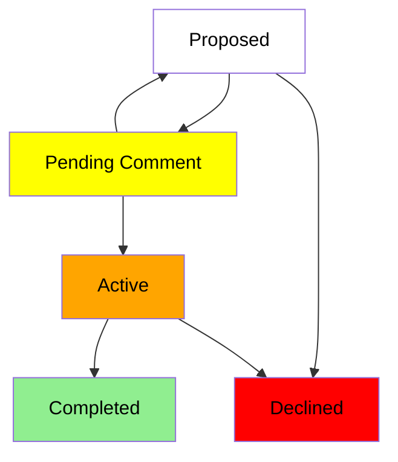

Electron’s [API Working Group](https://github.com/electron/governance/tree/main/wg-api) is
adopting an open **Requests for Comments (RFC)** process to help shepherd larger changes
to Electron core.

## Why RFCs?

In short, we want to smooth out the process of landing significant changes to Electron core.

Currently, new code changes are mostly discussed through issues and pull requests on GitHub.
For most changes to Electron, this is a good system. Many bug fixes, documentation changes,
and even new features are straightforward enough to review and merge asynchronously through
standard GitHub flows.

For changes that are more significant—for instance, large API surfaces or breaking changes
that would affect the majority of Electron apps—it makes sense for review to happen at the
ideation stage before most of the code is written.

This process is designed to be open to the public, which will also make it easier for the
open source community at large to give feedback on potential changes before they land in
Electron.

## How does it work?

The entire RFC process lives in the [electron/rfcs](https://github.com/electron/rfcs) repository
on GitHub. The steps are described in detail in the repository
[README](https://github.com/electron/rfcs/blob/main/README.md).

In brief, an RFC is **Proposed** once a PR is made to the `electron/rfcs` repository.
A Proposed RFC becomes:

- **Active** when the PR is merged into the `main` branch of the repository, which means that Electron
  maintainers are amenable to an implementation in `electron/electron`, or
- **Declined** if the PR is ultimately rejected.

:::info

For the RFC to become **Active**, the PR must be approved by at least 2 API Working Group members.
Before merging, the RFC should be presented synchronously and accepted unanimously by a quorum of at
least two-thirds of the WG members. If consensus is reached, a one-month final comment period will
be triggered, after which the PR will be merged.

:::

An Active RFC is **Completed** if the implementation has been merged into `electron/electron`.

## Who can participate?

Anyone in the Electron community can submit RFCs or leave feedback on the `electron/rfcs` repository!

- To see the list of active RFCs, refer to [the `text` folder in the repository](https://github.com/electron/rfcs/tree/main/text).
- To leave feedback on proposed RFCs, check out [the list of open PRs](https://github.com/electron/rfcs/pulls).
- To submit a new RFC, check out the repo’s [README](https://github.com/electron/rfcs) and [the RFC template](https://github.com/electron/rfcs/blob/main/0000-template.md).

We wanted to make this process a two-way dialogue and encourage community participation to get a
diverse set of opinions from Electron apps that might consume these APIs in the future. If you’re
interested in leaving feedback on currently proposed RFCs, the Electron maintainers have already created
a few:

- [Electron C APIs](https://github.com/electron/rfcs/pull/3)
- [Preload Realm for Service Workers](https://github.com/electron/rfcs/pull/4)

## Credits

Electron's RFC process was modeled on many established open source RFC processes.
Inspiration for many ideas and major portions of copywriting go to:

- [emberjs/rfcs](https://github.com/emberjs/rfcs)
- [reactjs/rfcs](https://github.com/reactjs/rfcs)
- [rust-lang/rfcs](https://github.com/rust-lang/rfcs)
- [tauri-apps/rfcs](https://github.com/tauri-apps/rfcs)
- [vuejs/rfcs](https://github.com/vuejs/rfcs)
- [yarnpkg/rfcs](https://github.com/yarnpkg/rfcs)
